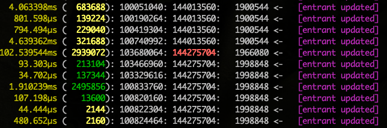

# memdebug


go mem debugger

## Install

`go get github.com/steveoc64/memdebug`

## Usage - Track Memory Allocations (slow)

In your code :

```
t1 := time.Now() // get the current time

... do stuff

memdebug.Print(t1, "entrant updated", data1, data2, ...)
```

produces output similar to this :



`801.598µs (  139224): 100190264: 144013560:   1900544 <-   [entrant updated]`

Data columns are :

- Time elapsed since t1

- (effect on memory)  Yellow = consumed, Green = freed

- Total memory application on the heap

- Total memory pool allocated from the OS (heap is a subset of this).  Should be the same number most of the time, but will print in red when it grows, grabbing more memory from the OS)

- Total stack size (should be pretty constant)

NOTE:

Using memdebug.Print() will slow the machine down quite a bit, because it does a full GC on each print, and a call to free OS memory, so as to get a super accurate picture of what is actually allocated and freed.

## Usage - CPU Profiling (not slow)

If you are more interested in CPU profiling, add this to your main.go:

```
	memdebug.Profile()
	defer memdebug.WriteProfile()
```

This will turn off the GC on each print, and the subsequent calls to free OS memory, which changes the output above to show an accurate picture of memory consumption without taking GC into account. ie - how your app actually performs in the wild.

In addition, it will give an accurate picture of CPU usage.

When the app exits, you will see some extra files in the root dir - namely

`cpu.pdf`

Which is a pproff`d PDF file showing a CPU trace where all the time is spent.

Nice !

## CPU Sampling

How to do multi-sampling 

At the start of main(), do this :

```
  memdebug.Profile()
```

Then in your code, when you want to capture a set of data, call
``` 
  memdebug.DumpProfile()
```

This will snapshot the data since the last call, and write to to a file.

You will end up with a number of PDF reports labelled

cpu-001.pdf
cpu-002.pdf
.. etc


